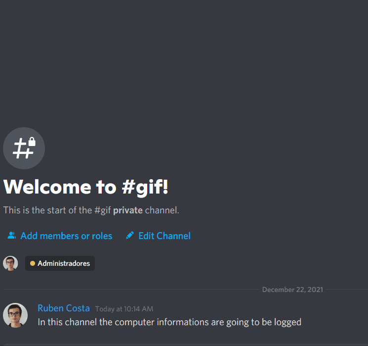

# Temporary file cleaner

- [Temporary File Cleaner](#-Temporary-file-cleaner)
    - [Project Explanation](#-Project-explanation)
    - [Project Status](#-Project-Status)
    - [Usage](#usage)
    - [What's New?](#whats-new)
    - [Question](#question)
    - [License](#license)
    - [Technologies](#links)

# About the project
This script was developed, so companies, don't have to worry about going to a computer and deleting temporary files (this can cause a loss of performance if not cleaned, this is more visible on low spec computers). And monitor the following information:

    - Cpu utilization
    - Memory utilization
    - General computer specs

You can also retrieve information about the system, over discord:
 

# Project Status
## 📃 To-do: 
    [] Getting information about CPU temperature
## 🛠️ Working on:
    [] Auto updating;

## ✅ Done: 
    [] Getting information about the disks
    [] Cleaning temporary files

# Configurations
    Creating a Discord Webhook:

<!-- - Create a webhook
- Go into config.ini file and assign the values, (inside the file there's an explanation about every setting)
- Download all the packages using `npm install`, use `npm build` to make an executable with nexe. (Caution: Some antivirus will flag it as a virus. Why? You may ask. Response: It removes OS folders, specifically temporary folders: ["temp", "%temp%", "prefetch"], so don't worry!)
- Optional:
    - Go to task scheduler: 
    - Click on: "Create Task"
    - Name the task something knowledgeable: e.g. "Monitor computer task"
    - Click on the "Triggers" tab
    - Use the default: "On schedule"
    - Change the start hour, so you are sure that at that time someone is using the computer, (if you want, use: "Repeat task every:", so the task will run itself). Click OK
    - Then go to the "Actions" tab, click on "New", leave everything as default, just change on "Program/script" to the .exe file directory
    - Then click "OK"
    - Then click "OK" again and close task manager (The program should run on the defined schedule)## Pre-requisites:
- Recommended having a discord server, to receive the data;   
- Then you are going to receive the data to the discord! -->

# Technologies
- [NodeJs](https://nodejs.org/)
- [Ini](https://www.npmjs.com/package/ini)
- [Nexe](https://github.com/nexe/nexe)

# 🆘 Help!

If you need any help send me an [email](mailto:rubenlavoscosta@gmail.com). Use the subject as: "Temporary file cleaner"

Made with <3 by Ruben Costa
