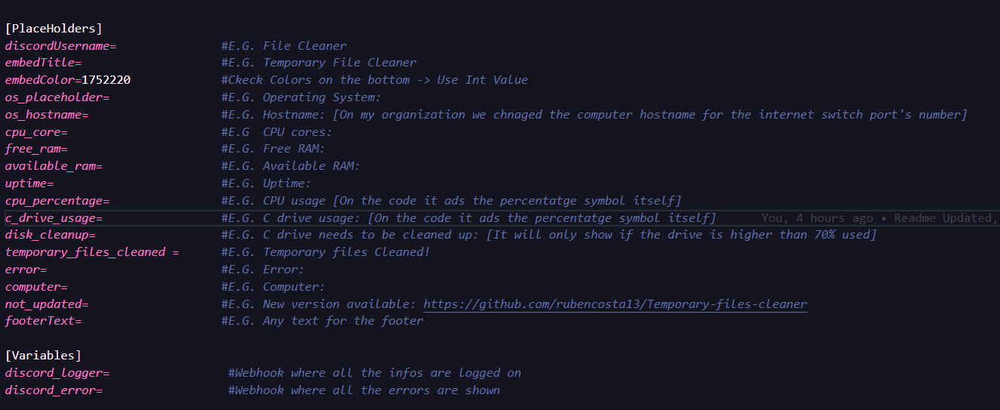
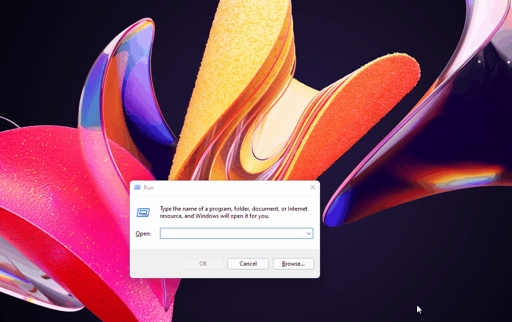

# Temporary file cleaner

- [Temporary File Cleaner](#-Temporary-file-cleaner)
    - [Project Explanation](#about-the-project)
    - [Project Status](#[project-status)
    - [Configurations](#configurations)
    - [Technologies](#technologies)
    - [Help](#sos-help)

## About the project
This script was developed, so companies, don't have to worry about going to a computer and deleting temporary files (this can cause a loss of performance if not cleaned, this is more visible on low spec computers). And monitor the following information:

    - Cpu utilization
    - Memory utilization
    - General computer specs

You can also retrieve information about the system, over discord:
 

# Project Status
## 📃 To-do: 
    [] Getting information about CPU temperature
## 🛠️ Working on:
    [] Auto updating;

## ✅ Done: 
    [] Getting information about the disks
    [] Cleaning temporary files

# Configurations
Creating a Discord Webhook:
 

 
Changing Config.ini settings:
 

 
Running the program:
 

 
 
 
You are able to run the program on the startup
 

 

# Technologies
- [NodeJs](https://nodejs.org/)
- [Ini](https://www.npmjs.com/package/ini)
- [Nexe](https://github.com/nexe/nexe)

# 🆘 Help!

If you need any help send me an [email](mailto:rubenlavoscosta@gmail.com). Use the subject as: "Temporary file cleaner"

Made with <3 by Ruben Costa
